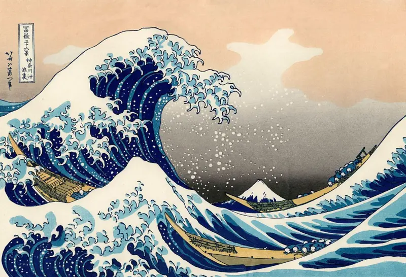

# 🎭 Estado da arte

A imagem icônica de *"A Grande Onda de Kanagawa"* não nasceu de um único lampejo de gênio, mas da disciplina de um processo iterativo e colaborativo. Antes da versão final que conhecemos, Hokusai, o artista visionário, explorou o tema por décadas, refinando sua ideia através de inúmeros esboços e tentativas.

A obra em si não é uma pintura, mas uma xilogravura — um feito que dependia da colaboração impecável entre Hokusai, os mestres entalhadores que traduziam sua visão para os blocos de madeira com precisão cirúrgica, e os impressores, que aplicavam as cores e a pressão exatas para garantir a qualidade final.

O verdadeiro salto para a perfeição não estava apenas na imagem, mas no **sistema operacional por trás dela**: os blocos de madeira foram a infraestrutura que, uma vez aperfeiçoada após incontáveis testes, permitiu replicar a visão do artista milhares de vezes com consistência absoluta. A arte final não residia apenas na visão, mas na maestria de um processo que a tornou tangível e escalável.

---

Essa mesma lógica fundamenta a disciplina de **Product Operations** no mundo dos produtos digitais. De forma direta, Product Operations é o sistema de "blocos de madeira" para as equipes de produto modernas. Assim como Hokusai precisava de artesãos e de um método replicável, as equipes de produto precisam de uma estrutura que transforme a visão estratégica em realidade.

A função do Product Ops é justamente **criar, refinar e manter esses "blocos"**: os processos, as ferramentas, os rituais de comunicação e os sistemas de dados que permitem à equipe de "artesãos" (time de produto, designers e engenheiros) executar seu trabalho de forma consistente, eficiente e escalável.

Ao organizar o caos operacional, Product Ops libera a equipe para focar no que faz de melhor: **inovar e entregar valor ao cliente**, transformando uma visão genial em um resultado replicável e impactante no mercado.

